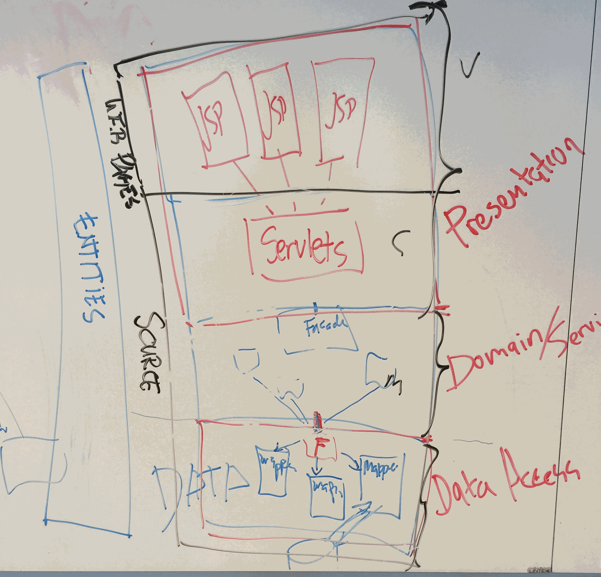

#Day 4: JSP and MVC pattern  

 

The MVC pattern translates to Model-View-Control
The idea is that we want modularize the architecture.

A quick white board drawing of the entire web application architecture on 2. semester could look like this: 

 

[Reading reference](https://www.tutorialspoint.com/design_pattern/mvc_pattern.htm)

## JSP
Java Server Pages  
[Reference ](https://www.tutorialspoint.com//jsp/index.htm)

### JSTL
JSP Standard Tag Library  
[Reference](https://www.tutorialspoint.com//jsp/index.htm)

### XSS - Cross Site Scripting
See the java project demo [here](../demo/crossSideScripting)
